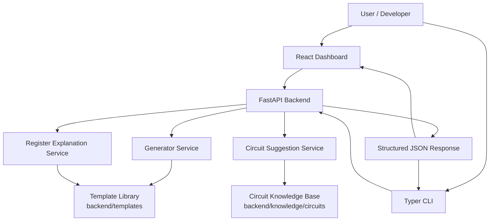
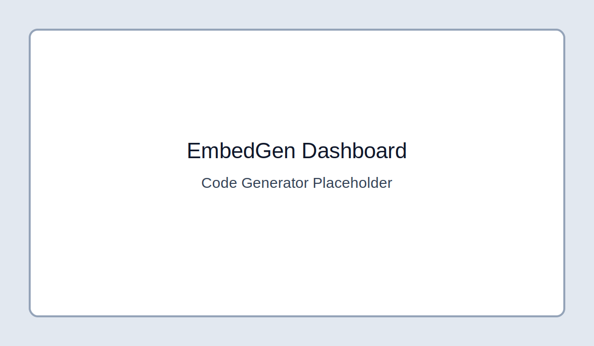
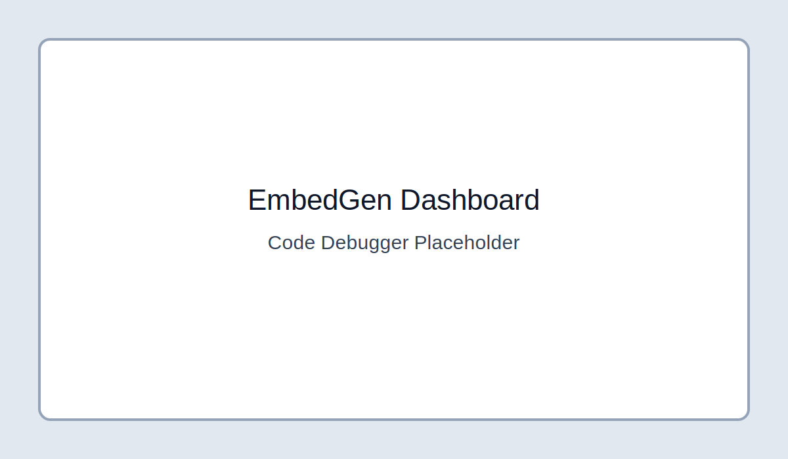
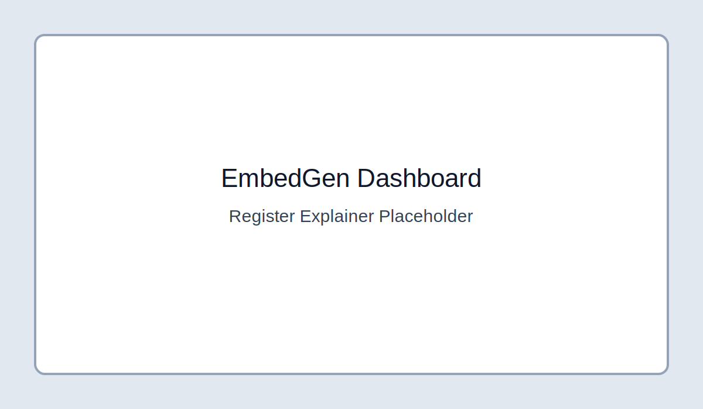

# EmbedGen

[](#installation)
[](#architecture)
[](#architecture)
[](LICENSE)

EmbedGen is an open source AI-assisted developer platform that converts natural-language requirements into **embedded C firmware starter code**, with additional outputs like **pin maps**, **register notes**, and **circuit wiring suggestions**.

---

## Project Overview

Firmware bring-up often starts with repetitive setup work: peripheral initialization, pin planning, and first-pass control loop scaffolding. EmbedGen accelerates this phase by providing structured outputs from simple prompts.

Given inputs such as:
- target microcontroller (e.g., LPC2148, Arduino Uno, ESP32, PIC16F877A)
- task description (e.g., "temperature sensor using ADC")

EmbedGen returns:
- generated embedded C template code
- explanation of generated behavior
- pin configuration suggestions
- optional circuit wiring guidance

---

## Feature List

- ✅ **Firmware generation API** (`POST /generate-code`)
  - Selects MCU + peripheral-oriented template from backend library
  - Returns C code, explanation, and pin configuration
- ✅ **Circuit suggestion API** (`POST /generate-circuit`)
  - Returns required components, pin connections, and wiring description
- ✅ **Register explanation API** (`POST /explain-registers`)
  - Provides concise register-level guidance from natural-language queries
- ✅ **CLI interface (Typer)**
  - `generate` and `explain` commands for terminal workflows
- ✅ **Frontend dashboard (React + Tailwind)**
  - Code Generator tab with syntax-highlighted code viewer, copy, and download actions
- ✅ **Template and knowledge catalogs**
  - MCU-specific firmware templates and circuit guidance in backend knowledge modules
- ✅ **Smoke tests** for critical API routes

---

## Supported MCU Families

- LPC2148
- Arduino Uno
- ESP32
- PIC16F877A

---

## Architecture



### Repository Layout

```text
/backend      FastAPI app, APIs, services, templates, circuit knowledge
/frontend     React + Tailwind dashboard
/cli          Typer CLI client
/examples     Embedded C sample files
/docs         Architecture and project documentation
/tests        Smoke and API behavior tests
```

---

## Installation

### 1) Clone

```bash
git clone https://github.com/Pm-das/EmbedGen.git
cd EmbedGen
```

### 2) Create virtual environment

```bash
python -m venv .venv
source .venv/bin/activate
```

### 3) Install Python dependencies

```bash
pip install -r requirements.txt
```

### 4) Frontend dependencies (if running UI locally, using `frontend/package.json`)

```bash
cd frontend
npm install
cd ..
```

---

## Example Usage

### Start backend

```bash
uvicorn backend.main:app --host 0.0.0.0 --port 8000 --reload
```

### Run tests

```bash
pytest -q
```


### Lint and format checks

```bash
ruff check .
black --check .
```

### Generate firmware code

```bash
curl -X POST http://localhost:8000/generate-code \
  -H "Content-Type: application/json" \
  -d '{
    "microcontroller": "LPC2148",
    "task": "Read ADC value and send via UART every second"
  }'
```

### Generate circuit suggestion

```bash
curl -X POST http://localhost:8000/generate-circuit \
  -H "Content-Type: application/json" \
  -d '{
    "microcontroller": "LPC2148",
    "task": "Temperature sensor using ADC"
  }'
```

### Explain registers

```bash
curl -X POST http://localhost:8000/explain-registers \
  -H "Content-Type: application/json" \
  -d '{
    "microcontroller": "LPC2148",
    "code": "U0LCR = 0x83; U0DLL = 97;"
  }'
```

---

## CLI Examples

```bash
python cli/embedgen_cli.py generate "UART code for LPC2148"
python cli/embedgen_cli.py generate "ADC temperature logger" --microcontroller "ESP32"
python cli/embedgen_cli.py explain "U0LCR = 0x83; U0DLL = 97;" --microcontroller "LPC2148"
```

Using a custom backend URL:

```bash
python cli/embedgen_cli.py generate "PWM for Arduino Uno" --api-url http://localhost:8000
```

You can also set:

```bash
export EMBEDGEN_API_URL=http://localhost:8000
```

---

## Screenshots (Placeholders)

> Replace these placeholders with real screenshots from your local environment.

### Code Generator


### Code Debugger


### Register Explainer


---

## Contribution Guide

Contributions are welcome and appreciated.

### Development workflow

1. Fork the repository
2. Create a feature branch
   ```bash
   git checkout -b feat/your-feature-name
   ```
3. Make your changes with tests/docs updates
4. Run checks locally
   ```bash
   pytest -q
   ```
5. Commit with a clear message
6. Open a Pull Request explaining:
   - motivation
   - implementation details
   - validation results

### Contribution expectations

- Keep changes scoped and well-documented
- Prefer explicit, typed, readable code
- Add or update tests for behavior changes
- Update `README.md` / `docs/` when interfaces change

---

## CI/CD

- GitHub Actions workflow at `.github/workflows/ci.yml` runs linting (`ruff`), formatting (`black --check`), and tests (`pytest`) on every push and pull request.

---

## Roadmap

### Near Term
- [ ] Expand circuit knowledge coverage beyond ADC temperature sensing
- [ ] Add richer peripheral intent detection from natural-language tasks
- [ ] Improve API validation and error payload consistency
- [ ] Add CLI tests and frontend integration tests

### Mid Term
- [ ] Add board profiles (clock assumptions, pin presets, toolchain hints)
- [ ] Add project export bundles (code + wiring + notes)
- [ ] Introduce user-configurable template styles (bare-metal vs HAL)
- [ ] Add authentication for hosted/multi-user deployments

### Long Term
- [ ] Integrate compile/simulate feedback loops for generated firmware
- [ ] Support custom plugin packs for additional MCU families
- [ ] Add versioned generation history and collaboration workflows
- [ ] Integrate model-backed synthesis with confidence scoring

---

## License

This project is licensed under the terms in [LICENSE](LICENSE).
